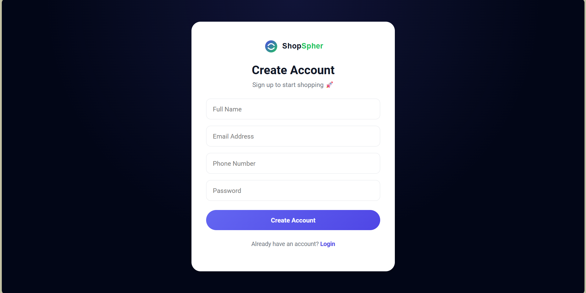
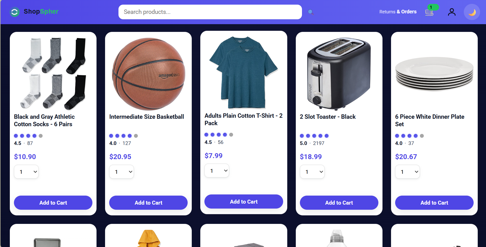
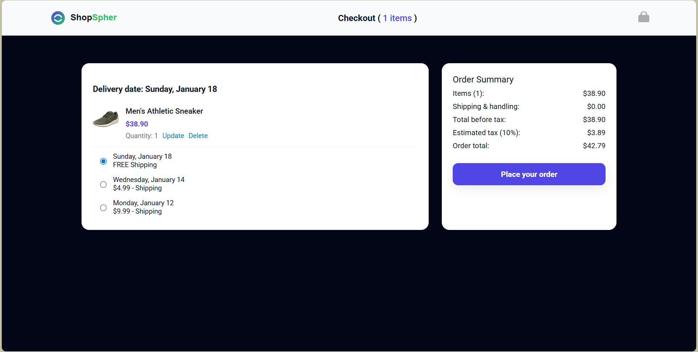

# 🛒 ShopSpher – Shopping Hub

ShopSpher is a modern, responsive **e-commerce web application** built using **HTML, CSS, and Vanilla JavaScript**.  
It simulates a complete shopping experience including authentication, cart management, checkout, order tracking, profile management, and dark mode — all powered by **browser localStorage** (no backend required).

---

## 🌐 Live Preview
> Open `home.html` using VS Code Live Server or directly in your browser.

---

## ✨ Key Features

### 🛍️ Product & Shopping
- Dynamic product grid layout
- Responsive design (mobile, tablet, desktop)
- Product search with live suggestions
- Quantity selection before adding to cart
- Smooth add-to-cart animation feedback
- Cart badge updates in real-time

### 🛒 Cart & Checkout
- Persistent cart using localStorage
- Update quantity and delete items
- Delivery options selection
- Tax calculation
- Clean checkout layout (Stripe-inspired)
- Empty cart state handling

### 📦 Orders & Tracking
- Orders history page
- Order confirmation page
- Individual order tracking page
- Delivery progress visualization
- Buy Again functionality

### 👤 Authentication & Profile
- Signup and Login pages
- Persistent session handling
- Profile page with user details:
  - Name
  - Email
  - Phone
- Logout functionality
- Profile icon navigation

### 🌗 UI & Experience
- Light / Dark theme toggle
- Smooth animations and transitions
- Modern clean UI components
- Custom product rating UI (non-Amazon style)
- Fully responsive layout
- Brand-based header styling

---

## 📸 Screenshots (Optional)

